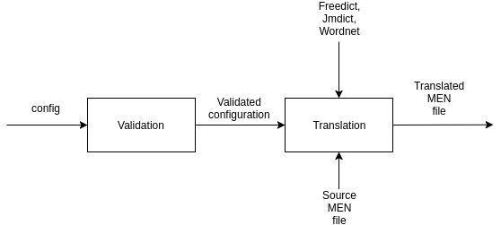
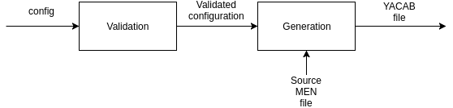

# MuMEN

[![GitHub release][release-image]][release-url]
[![Build][travis-image]][travis-url]
[![Dependencies][requires-image]][requires-url]
[![Code Coverage][coverage-image]][coverage-url]
[![Code Quality][quality-image]][quality-url]
[![MIT License][license-image]][license-url]

## Specifications
1. Input pairs of words from the MEN dataset and output translated pairs in a target language
2. Input pairs of words from the MEN dataset and output a set of questions formatted for YACAB
3. Input a YACAB dump containing a list of crowdsourced annotations and output a MEN dataset


## HowTo
### Run MuMEN
Before installing and runing MuMEN you need to install both ```libxsl``` and ```libxml2``` libraries, on Ubuntu:
```
sudo apt-get install libxml2-dev libxslt-dev
```


To run MuMEN, in the application folder, do:
```
python3 setup.py develop
```
Few more NLTK dependencies has to be installed to be able to run it correctly:

```python
import nltk

nltk.download('nltk')
nltk.download('omw')
```

Then **download** the freedict xml files from [FreeDict](https://github.com/freedict/fd-dictionaries) and put it in ```data/freedict``` as explained there!
Also **download** the JMDict_e xml files from [JMDict](http://edrdg.org/jmdict/edict_doc.html#IREF01) and put it in ```data/jmdict``` as explained in the README there.


Then run:
```
mumen config/config.yml
```
to launch the application with the standard config

## Pipeline

The pipeline is divided in 3 indipendent section.

### Translation

This section will load a MEN file and it will translate it in an another language.



### Generation

This section will load a MEN file and it will generate a YACAB survey file.



### Computation

This section will load a YACAB survey result file and it will generate a new MEN file with the computed similarities.


## Useful stuff


### Dictionaries
[WordNet](http://wordnet.princeton.edu/), [FreeDict](http://freedict.org/en/) and [JMDict](http://edrdg.org/jmdict/j_jmdict.html)

### Arabic Preprocessing

The [Stanford Arabic NLP Toolkit](https://nlp.stanford.edu/projects/arabic.shtml) offers:

* A dependency parser trained on the Penn Arabic Treebank
* A word segmenter
* A POS tagger

The [Microsoft Arabic NLP Toolkit](https://www.microsoft.com/en-us/research/project/arabic-toolkit-service-atks/) offers:

* A diacritizer
* A NER
* A morphological analyzer
* A speller
* A transliterator

[Arabic normalizer](http://alt.qcri.org/tools/arabic-normalizer/)
See also [TED Talks datasets](https://wit3.fbk.eu/)

In terms of corpora, if Wikipedia is not enough we could use the [Gigaword corpus](https://catalog.ldc.upenn.edu/LDC2003T12). Apparently it contains
nearly 400 million words.

### Japanese Preprocessing

There are several popular tools in the Japanese NLP community:
* [Mecab](https://taku910.github.io/mecab/) a POS tagger and morphological
analyzer for Japanese
* [Cabocha](http://taku910.github.io/cabocha/) a dependency-structure analyzer

Both are coded in C++ by [Taku Kudo](http://chasen.org/~taku/index.html.en)
but there are some Python wrappers available on GitHub.

* [Kuromoji](http://www.atilika.org/) also does the same thing as Mecab, but
is coded in Java. It seems well maintained (see their [GitHub](https://github.com/atilika/kuromoji)).

In terms of corpora, a good list is available [here](https://www.ninjal.ac.jp/english/database/type/corpora/) and the
balanced corpus of contemporary written Japanese
([BCCWJ](http://pj.ninjal.ac.jp/corpus_center/bccwj/en/)) contains roughly
100 million words (I have a copy of the corpus) but with extensive
morphological annotation.

### Progress
- Remove most of the error of the linter

### ToDo:
- Repair this wrapper of FreeDict
- Create a marshaller jmdict which pass the build
- Do all the tests (for pytest)
- Do tests for translator (mumen.translatation.translator)


## Evaluation template
| Standard                                | YES |  NO |
| --------------------------------------- | :-: | :-: |
| Does the app build correctly           |     |     |
| Is the test coverage 100%           |     |     |
| Is the codeclimate metric equal to 4    |     |     |
| Does the README include clear instructions on how to run the app          |     |     |
| Do those instructions work          |     |     |
| Is the pipeline of the application documented          |     |     |
| Is it documented in a diagram         | | |
| Does the architecture of the application match the documented pipeline    | | |
| Is the team progress clearly documented in the README (with a list of completed tasks and remaining todos)        | | |
| Is the list of todos comprehensive       | | |
| Is the architecture scalable (can additionnal modules, languages, utils be added without breaking the app)        | | |
| Are architectural choices consistent across the app       | | |
| Is the config fully externalized        | | |
| Is the setup.py fully configured for modularization with PyPy        | | |
| Are all good practices respected        | | |
| Do docstrings fully respect Google and pydocstyle v2.0.0 standards for export to Sphinx       | | |
| Does the application use loggers       | | |


[release-image]:https://img.shields.io/github/release/akb89/mumen.svg?style=flat-square
[release-url]:https://github.com/akb89/mumen/releases/latest
[travis-image]:https://img.shields.io/travis/akb89/mumen.svg?style=flat-square
[travis-url]:https://travis-ci.org/akb89/mumen
[coverage-image]:https://img.shields.io/codeclimate/coverage/github/akb89/mumen.svg?style=flat-square
[coverage-url]:https://codeclimate.com/github/akb89/mumen/coverage
[quality-image]:https://img.shields.io/codeclimate/github/akb89/mumen.svg?style=flat-square
[quality-url]:https://codeclimate.com/github/akb89/mumen
[license-image]:http://img.shields.io/badge/license-MIT-000000.svg?style=flat-square
[license-url]:LICENSE.txt
[requires-url]: https://requires.io/github/akb89/mumen/requirements
[requires-image]: https://img.shields.io/requires/github/akb89/mumen.svg?style=flat-square
